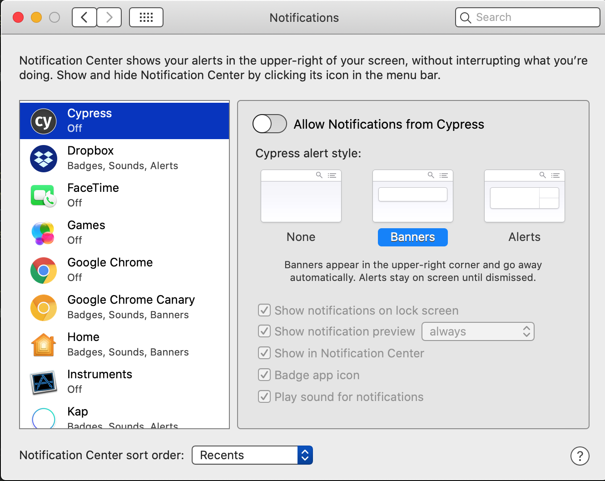
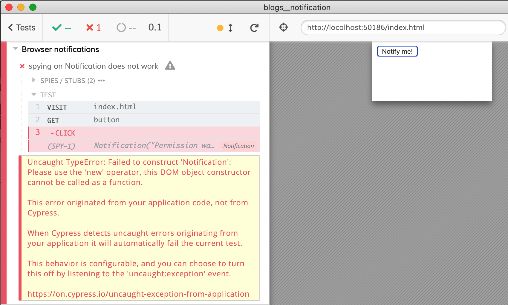

# Testing browser notifications

You can find the sample app in [index.html](index.html) and all tests in [cypress/integration/spec.js](cypress/integration/spec.js). The tests spy / stub Notification function in various ways to check how the app handles:
- permission was granted before
- permission was denied before
- permission was neither granted nor denied before, so the app asks the user and acts depending on the answer


## Checking if the browser supports notifications

The first test just checks that the browser supports notifications

```js
it('are supported by the test browser', () => {
  cy.visit('index.html')
  cy.window().should('have.property', 'Notification').should('be.a', 'function')
})
```

If you enable notifications from Cypress itself, you will see a popup if you click "Notify me!" button.




The rest of the tests stubs Notification constructor to avoid popups

## Cannot use spy

⚠️ In the tests we use `cy.stub(win, 'Notification')` and not `cy.spy(win, 'Notification')` because the [Sinon.js spy](https://on.cypress.io/spy) Cypress creates does not call the original function with `new` keyword.



## See also

- Cypress guide to [Stubs, spies and clocks](https://on.cypress.io/stubs-spies-and-clocks)
- Read [Mozilla Notification page](https://developer.mozilla.org/en-US/docs/Web/API/Notification)
- [`cy.stub`](https://on.cypress.io/stub)
